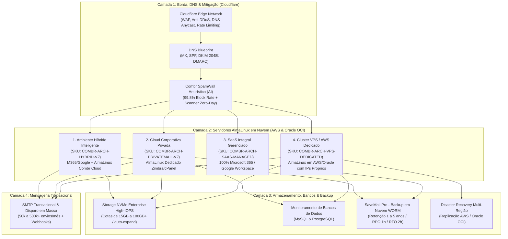

# ☁️ Mapeamento de Arquitetura em Nuvem

> **Projeto:** Wizard Pattern &bull; Combr Soluções em Nuvem  
> **Categoria:** Requisitos Técnicos Essenciais &bull; Infraestrutura & Cloud  
> **Versão:** 2.0.0

---

## 1. Visão Geral da Arquitetura

O **Enterprise Mail Setup Wizard** da **Combr Soluções em Nuvem** ([combr.com.br](https://combr.com.br/)) atua como um gerador interativo de configuração e diagnóstico arquitetural (`DiagnosticEngine`). O sistema realiza uma **curadoria simplificada** para dimensionar a infraestrutura de mensageria corporativa, mitigando riscos de segurança e preparando servidores corporativos dedicados.

### Pilares de Infraestrutura da Combr:
- **Sistema Operacional Base:** Servidores corporativos padronizados em **AlmaLinux** (estabilidade empresarial, segurança hardened e ciclo de suporte estendido).
- **Provedores de Nuvem (Multi-Cloud):** Instâncias de alto desempenho em **AWS (Amazon Web Services)** e **Oracle Cloud Infrastructure (OCI)**.
- **Camada de Borda & Mitigação de Ataques:** Proteção perimetral com **Cloudflare** (DNS Anycast de ultrabaixa latência, WAF contra ataques de força bruta, mitigação DDoS e proxy de segurança).
- **Mensageria & Colaboração:** Ambientes híbridos, Zimbra Collaboration e cPanel Enterprise em AlmaLinux.
- **Banco de Dados & Aplicações:** Monitoramento e alta disponibilidade para **MySQL** e **PostgreSQL**, além de sustentação para **sites institucionais** corporativos.
- **Continuidade & Backup:** Soluções de backup corporativo em nuvem (SaveMail WORM / Snapshots remotos).

---

## 2. Modelos de Arquitetura Mapeados



### Detalhamento dos 4 Modelos:

### 🔹 1. Ambiente Híbrido Inteligente (Combr HybridCloud)
- **SKU:** `COMBR-ARCH-HYBRID-V2`
- **Tier:** Enterprise Hybrid
- **Infraestrutura Alvo:** Servidores **AlmaLinux** na Cloud Combr (AWS / Oracle OCI) + Conector API M365/Google Workspace.
- **Mecanismo de Split-Domain:** E-mails da diretoria e executivos no Microsoft 365 ou Google Workspace (Office/Teams/Meet), enquanto equipes operacionais rodam na nuvem AlmaLinux Combr.
- **Benefício Financeiro:** Redução de custos de até **68% a 70%** na fatura de licenciamento.

### 🔹 2. Cloud Corporativa Privada (Zimbra / cPanel em AlmaLinux)
- **SKU:** `COMBR-ARCH-PRIVATEMAIL-V2`
- **Tier:** Dedicated Sovereign Cloud
- **Infraestrutura Alvo:** Instância dedicada **AlmaLinux** (AWS / Oracle Cloud / Data Centers Tier III no Brasil).
- **Características:** Soberania nacional dos dados (LGPD), sincronização CalDAV/CardDAV para celulares, Webmail moderno e custos fixos previsíveis em BRL.

### 🔹 3. SaaS Integral Gerenciado (Microsoft 365 / Google Workspace)
- **SKU:** `COMBR-ARCH-SAAS-MANAGED`
- **Tier:** Full SaaS Managed
- **Infraestrutura Alvo:** Microsoft Azure / Google Cloud Platform com suporte especializado Combr 24x7.
- **Características:** Faturamento unificado em moeda nacional (BRL), isenção de IOF/flutuações cambiais do Dólar e gestão técnica inclusa.

### 🔹 4. Cluster VPS / Servidor Dedicado AlmaLinux (AWS & Oracle Cloud)
- **SKU:** `COMBR-ARCH-VPS-DEDICATED`
- **Tier:** Dedicated High-Compute VPS
- **Infraestrutura Alvo:** **AlmaLinux Enterprise** em instâncias computacionais **AWS EC2** ou **Oracle Cloud Infrastructure (OCI)** com IPs dedicados exclusivos.
- **Características:** Isolamento absoluto de hardware, filas de processamento isoladas, reputação própria de IP e monitoramento ativo de banco de dados (MySQL/PostgreSQL).

---

## 3. Matriz de Componentes Técnicos de Infraestrutura

| Camada | Componente | Descrição Técnica | SLA / Especificação |
| :--- | :--- | :--- | :--- |
| **Borda & Segurança** | Cloudflare Edge & WAF | Proteção perimetral contra ataques de força bruta, WAF de e-mail e DNS Anycast | Mitigação DDoS / Latência < 15ms |
| **Sistema Operacional** | AlmaLinux Enterprise 9 | SO empresarial Linux RHEL-compatible, hardened e otimizado para MTA/Maildir | Suporte de ciclo longo (LTS) até 2032 |
| **Nuvem Computacional** | AWS EC2 / Oracle Cloud (OCI) | Instâncias dedicadas escaláveis para hospedagem corporativa e sites institucionais | Uptime de 99.9% a 99.99% |
| **Banco de Dados** | MySQL & PostgreSQL | Bancos relacionais para catálogo, webmails (Roundcube/Zimbra) e dados institucionais | Monitoramento 24x7 / Health-check ativo |
| **Armazenamento** | NVMe Enterprise High-IOPS | Storage em array NVMe com I/O ultra rápido e auto-expansão de cota | Anexos até 50 MB / IOPS dedicado |
| **Continuidade** | SaveMail Pro (Backup em Nuvem) | Arquivamento externo imutável (*Write Once, Read Many*) | Retenção 1.825 dias (5 anos) / RPO: 1h / RTO: 2h |
| **Alta Disponibilidade** | Multi-Region Disaster Recovery | Redundância geográfica em dois data centers (AWS / Oracle OCI) | RPO: 15 min / RTO: 30 min / SLA 99.95% |
| **SMTP Relay** | Pool de IPs Dedicados | Roteamento separado para disparo de grande volume e transacional | Quota de 50.000 a 500.000+ envios/mês |
| **Automação SRE** | Ansible & Terraform | Provisionamento automático via Playbooks e módulos declarativos para AlmaLinux | `site-mail-provision.yml` / `combr_enterprise_mail` |

---

## 4. Integração com Automação de Infraestrutura (IaC)

O diagnóstico mapeado é traduzido diretamente em variáveis consumíveis para automação em servidores AlmaLinux:

### Ansible Directives:
```yaml
# Playbook: site-mail-provision.yml (Target: AlmaLinux 9)
domain_name: "empresa.com.br"
target_os: "almalinux-9"
cloud_provider: "aws" # ou "oracle_oci"
mailboxes_qty: 35
quota_gb: 25
enable_savemail: true
enable_spamwall: true
cloudflare_proxied: true
hybrid_split_domain: true
db_engine: "mysql" # ou "postgresql"
```

### Terraform Directives:
```hcl
module "combr_enterprise_mail" {
  source              = "./modules/enterprise_mail_almalinux"
  client_id           = "techsolutions"
  domain              = "empresa.com.br"
  os_distro           = "almalinux-9"
  cloud_platform      = "oracle_oci" # ou "aws"
  cluster_tier        = "combr-arch-hybrid-v2"
  storage_capacity_gb = 875
  dedicated_ips_count = 1
  cloudflare_zone_id  = "023e105f4ecef8ad9ca31a8372d0c353"
}
```
