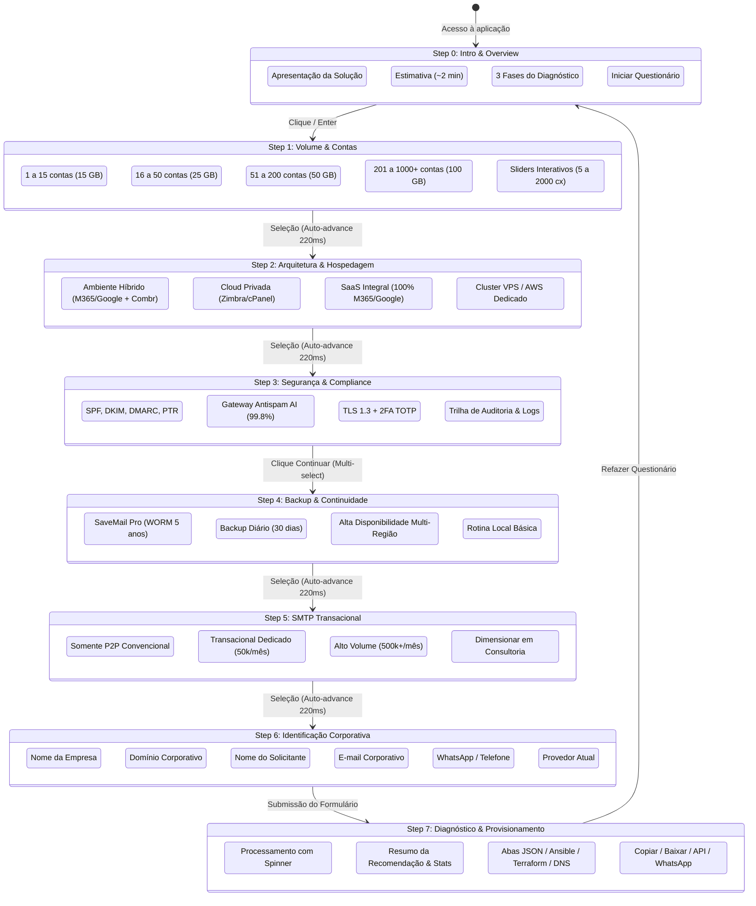

# 📐 Wireframes e Fluxo de Navegação

> **Projeto:** Wizard Pattern &bull; Combr Soluções em Nuvem  
> **Categoria:** Requisitos Técnicos Essenciais &bull; Arquitetura de Informação & Wireframes  
> **Versão:** 2.0.0

---

## 1. Diagrama de Fluxo de Estados (User Journey)

O fluxo do usuário é composto por 8 etapas (Step 0 ao 7), organizadas de forma linear e progressiva para maximizar a conversão e precisão do diagnóstico.



---

## 2. Wireframes Conceituais das Etapas

### 🖥️ Estrutura Global do Header & Barra de Progresso
```text
+-------------------------------------------------------------------------------+
|  [Logo Combr]        [<- Voltar]   [Barra: =============> 60%]     (~2 min)   |
+-------------------------------------------------------------------------------+
```

---

### 🖥️ Wireframe: Step 0 (Intro & Overview)
```text
+-------------------------------------------------------------------------------+
|                                [ LOGO BOX ]                                   |
|                         DIAGNÓSTICO ARQUITETURAL                              |
|          Descubra a infraestrutura de e-mail ideal para sua empresa           |
|  Responda a perguntas rápidas para receber uma recomendação personalizada.   |
|                                                                               |
|  +-------------------------------------------------------------------------+  |
|  | (1) Volume de Contas & Usuários                   [30 seg]              |  |
|  |     Mapeamento de caixas postais, cotas individuais e storage total.   |  |
|  |                                                                         |  |
|  | (2) Arquitetura, Segurança & Backup               [1 min]               |  |
|  |     Nuvem híbrida, proteção SPF/DKIM/DMARC e SaveMail WORM.             |  |
|  |                                                                         |  |
|  | (3) Recomendação & Especificação                  [Instantâneo]         |  |
|  |     Relatório técnico com JSON formatado para orquestração e SRE.       |  |
|  |                                                                         |  |
|  | [🔒 Respostas salvas localmente]              [ Iniciar Questionário -> ]|  |
|  +-------------------------------------------------------------------------+  |
+-------------------------------------------------------------------------------+
```

---

### 🖥️ Wireframe: Step 1 (Volume & Sliders Livres)
```text
+-------------------------------------------------------------------------------+
|  VOLUME & CONTAS                                                              |
|  Quantas caixas postais corporativas sua empresa precisa atender?             |
|                                                                               |
|  +-------------------------------------------------------------------------+  |
|  | [ ( ) ] 1 a 15 Contas [ 1 ]                            [Pequena Equipe] |  |
|  +-------------------------------------------------------------------------+  |
|  | [ (o) ] 16 a 50 Contas [ 2 ]                           [PME Crescimento]|  |
|  +-------------------------------------------------------------------------+  |
|  | [ ( ) ] 51 a 200 Contas [ 3 ]                          [Média Empresa]  |  |
|  +-------------------------------------------------------------------------+  |
|  | [ ( ) ] 201 a 1.000+ Contas [ 4 ]                      [Enterprise]     |  |
|  +-------------------------------------------------------------------------+  |
|  | [ ( ) ] Volume Personalizado (Sliders Livres) [ 5 ]    [Personalizado]  |  |
|  |         +-------------------------------------------------------------+ |  |
|  |         | Caixas Postais: [===========o==============]  50 caixas      | |  |
|  |         | Cota por Caixa: [=====o====================]  25 GB / conta  | |  |
|  |         | Capacidade Dimensionada: 1.25 TB Total                      | |  |
|  |         +-------------------------------------------------------------+ |  |
|  +-------------------------------------------------------------------------+  |
|                                                                               |
|  [Selecione uma opção]                          [ Continuar para Arquitetura ]|
+-------------------------------------------------------------------------------+
```

---

### 🖥️ Wireframe: Step 7 (Resultado & Diagnóstico Técnico)
```text
+-------------------------------------------------------------------------------+
|  [ ✓ Recomendação Concluída ]                                                 |
|                                                                               |
|  +-------------------------------------------------------------------------+  |
|  | ARQUITETURA RECOMENDADA                                                 |  |
|  | Arquitetura Híbrida Inteligente (Combr HybridCloud)                     |  |
|  | Diretoria no M365/Google + Operação na Cloud Combr (Até 70% de economia)|  |
|  |                                                                         |  |
|  | [ 35 Caixas ]    [ 875 GB Total ]    [ Score: 95/100 ]    [ RPO: 1h ]   |  |
|  +-------------------------------------------------------------------------+  |
|                                                                               |
|  +-------------------------------------------------------------------------+  |
|  | [especificacao-dimensionada.json]     [ 📋 Copiar JSON ] [ 💾 Baixar .json ]|
|  |-------------------------------------------------------------------------|  |
|  | {                                                                       |  |
|  |   "$schema": "https://api.combr.com.br/schemas/email-infra-v2.json",    |  |
|  |   "meta": { "requestId": "REQ-A5C2A6C2-49CD", "version": "2.0.0" },     |  |
|  |   "customer": { "organization": "Tech Solutions", ... },                |  |
|  |   "provisioningSpec": { ... }                                           |  |
|  | }                                                                       |  |
|  +-------------------------------------------------------------------------+  |
|                                                                               |
|  [ ↺ Refazer Questionário ]                            [ 💬 Falar no WhatsApp ]|
+-------------------------------------------------------------------------------+
```
